# Online-Booking

Online-Booking is a web application designed to streamline the online booking process for wellness events, such as health talks and onsite screenings. The platform also provides a mechanism for vendors to review and either approve or reject these event requests.

You can check Live App Demo [Here](https://wellness-event-booking.vercel.app)


# Prerequisites

Before you begin, ensure you have met the following requirements:
* Node JS v20.9.0
* Google Map APIKEY [Tutorial](https://developers.google.com/maps/documentation/javascript)

# User Test Credential

- **HR Account**
  - super@shield.com
  - super@sword.com
- **Vendor Account**
  - super@holistic.com
  - super@tranquil.com
  - super@habits.com
  - super@active.com
  - super@serenity.com

  **Password for all account** : ```P@ssw0rd!```
# Using Online-Booking
Add .env file with these variables
```env
VITE_BASE_URL=http://localhost:3000/api/v1 //exactly same
VITE_GOOGLE_MAP_API_KEY=<YOUR GOOGLE MAP API KEY>
```

Installing dependencies :
```
npm install
```
Run application :
```
npm run dev
```

# Pages and Components
Online-Booking consists of 2 pages:

- Login Page
- Dashboard Page (Distinct dashboard interfaces for Company HR and Vendors)
It also includes 3 modal types:

- View Modal (Distinct modal interfaces for Company HR and Vendors)
- Create Modal (Only for Company HR)
- Confirm Modal (Only for Vendor)

# App Flow

- ### **Base Flow**


    Every time you go to the website, if you are not logged in, you will be redirected to the Login Page.

    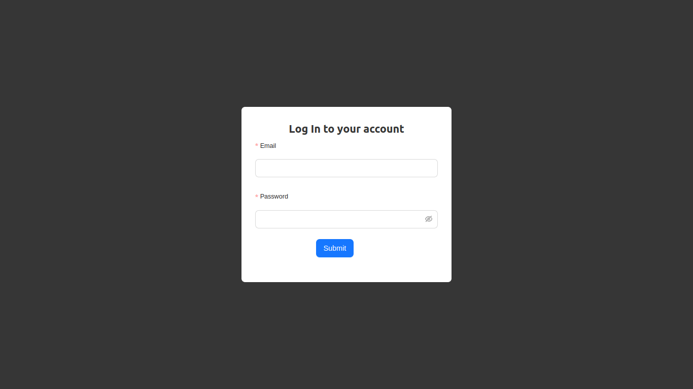

- ### **HR Flow**

    - After logging in as an HR, you will be redirected to the Dashboard Page with an initially empty table.
    
    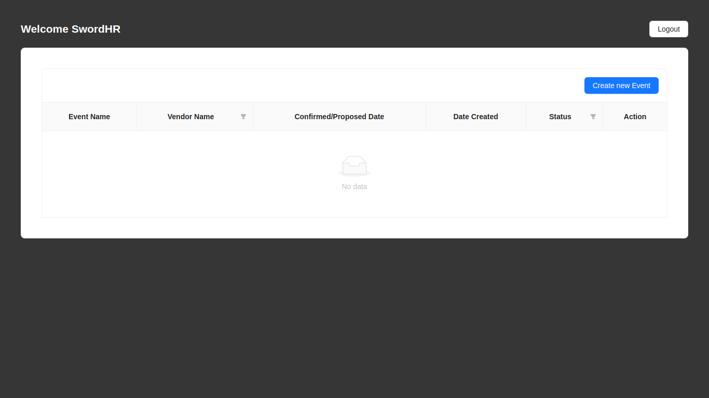

    - To create an event, click the 'Create New Event' button in the top right of the table
    
    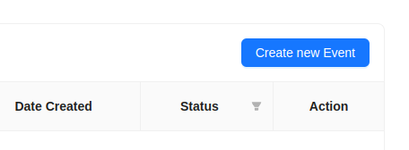

    - After clicking the button, the Create Modal will appear.
    
    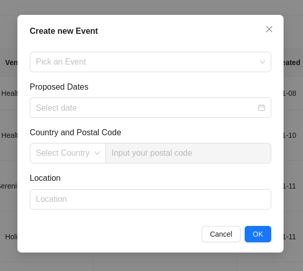

    - ***Modal Explanation***

      - **Event** 
          
           Select an Event you want to book
      - **Proposed Dates** 
          
           Select 3 Proposed Dates of your event
      - **Country and Postal Code** 
          
           Select your country and postal code. You must select the country first before inputting your postal code (the location section will auto-generate based on the postal code).
      - **Location** 
          
           The location will auto-generate after filling the Country and Postal Code section, but you can change the location with free text.

      After filling all sections, click **OK** to propose the event to the vendor.

    - The created event will appear in the dashboard with a **'Pending'** status, indicating that your event is under review by the vendor
    
    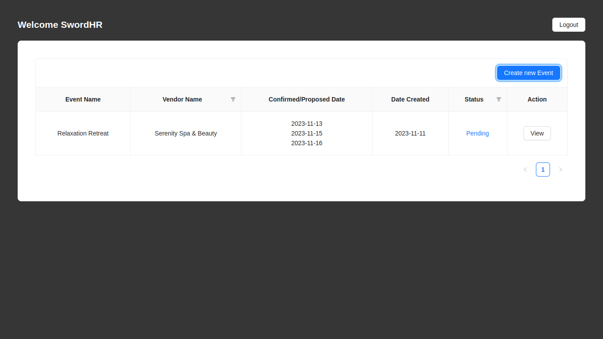

    - ***Table Explanation***
      - **Event Name**

          The name of the booked event
      - **Vendor Name**

          Vendor name for the event
      - **Confirmed/Proposed Date**

          Confirmed/Proposed date of your event. If there are multiple dates, the column value represents the proposed date, whereas a single date signifies a confirmed date.
      - **Date Created**

          Date the event was created/proposed.
      - **Status**

          Status of your event (Pending, Approved, or Rejected).
      - **Action**

          This column will always have a 'View' button to see the event details. If you click on it, the View Modal will appear.

          - Example of HR View modal based on Status
            - **Pending**

            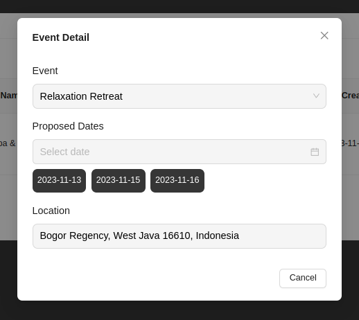

            - **Approved**

            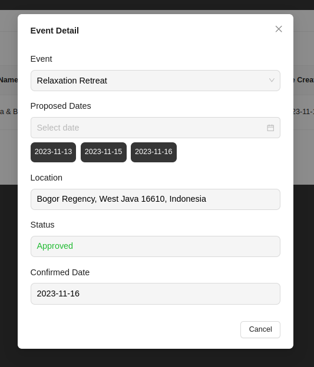

            - **Rejected**

            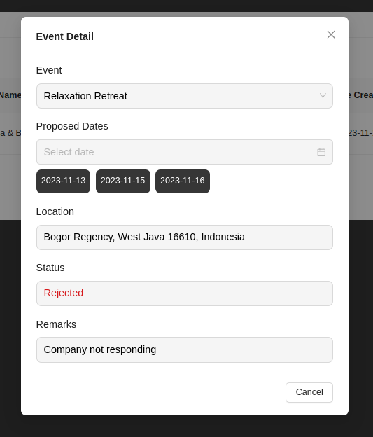


- ### **Vendor Flow**

  - As a vendor, you **cannot** create/book an event. After logging in as a Vendor, you will be redirected to the Dashboard Page.

    **Table with no Data**

    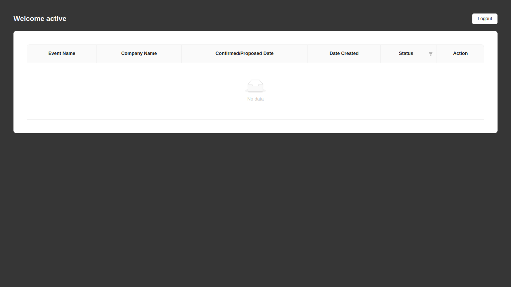

    **Table with Data**

    


    - ***Table Explanation***

      When login as a **Vendor** there are two columns that are different from HR table
      
      - **Company Name**

        Represents the company that booked one of your events.

      - **Action**

        In the action column, if you view an event with a 'Pending' status, a modal with 'Approve' and 'Reject' buttons will appear.

        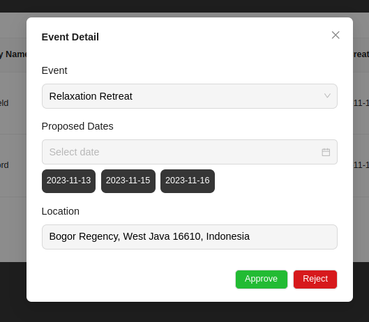

        Clicking **'Approve'** will show another modal with a selection of proposed dates.

        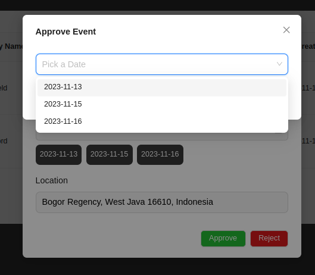
        
        Clicking **'Reject'** will show another modal with an input field for explaining why the event is rejected.

        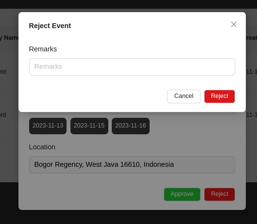

        - ***Confirm Modal Explanation***
          - Approve

            If you click approve, it will change the event status to 'Approved' and have a confirmed date value.

          - Reject
            
            If you click reject, it will change the event status to 'Rejected' and have a remarks value that you can see in the view modal.